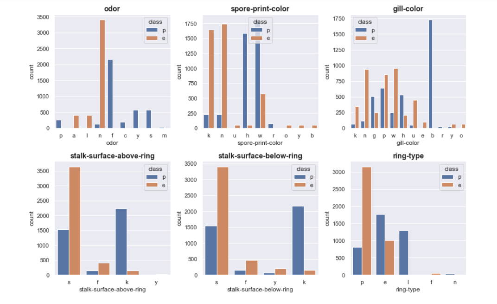
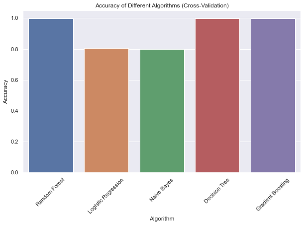

<!DOCTYPE html>
<html>

<body>
  <h1>MushroomTech: Exploratory Data Analysis and ML Classification on Mushroom Dataset</h1>
  
  <h2>Description</h2>
  
MushroomSense is an exploratory data analysis and machine learning classification project focused on the Mushroom Classification dataset. The project aims to analyze and understand the key features that determine the toxicity of mushrooms and develop a predictive model to classify mushrooms as toxic or non-toxic. By leveraging various machine learning algorithms and techniques, MushroomSense provides a user-friendly tool to assist individuals in making informed decisions about mushroom consumption.

  
  <h2>Technology Stack</h2>
  <ul>
    <li>Python</li>
    <li>Flask (Backend)</li>
    <li>React (Frontend)</li>
    <li>Docker (Deployment)</li>
  </ul>
  
  <h2>Components</h2>
  <ul>
    <li><strong>Exploratory Data Analysis (EDA):</strong> Perform in-depth analysis on the Mushroom Classification dataset to understand the characteristics that determine mushroom toxicity.</li>
    <li><strong>Machine Learning Classification:</strong> Develop a predictive model using machine learning algorithms to classify mushrooms as toxic or non-toxic based on their features.</li>
    <li><strong>React Frontend:</strong> Create a user-friendly web application that provides information about mushrooms and helps users identify mushrooms using an API.</li>
    <li><strong>API (Random Forest Algorithm):</strong> Implement an API using Flask and Python to serve predictions based on a Random Forest machine learning model.</li>
    <li><strong>Docker Deployment:</strong> Deploy the application using Docker, allowing for easy setup and portability across different environments.</li>
  </ul>
  
  <h2>Skills and Technologies Learned</h2>
  
In this project, I gained hands-on experience in:

  <ul>
    <li>Data analysis and exploration using Python libraries such as Pandas, Matplotlib, Seaborn, NumPy, and SciPy.</li>
    <li>Building machine learning models for classification using Scikit-learn.</li>
    <li>Developing a web application frontend using React.</li>
    <li>Creating a backend API using Flask and Python.</li>
    <li>Containerizing the application using Docker for easy deployment and scalability.</li>
  </ul>
  
  <h3>Exploratory Data Analysis (EDA)</h3>
  <ul>
    <li>Load and explore the dataset.</li>
    <li>Perform chi-square test to identify associations between categorical variables.</li>
    <li>Create visualizations to understand feature relationships.</li>
  </ul>
  <h3>EDA Images</h3>
  
  

    

      
      
Pie chart for each column

    

    

      
      
bargraph

    

    

      
      
chi-square 

    

    

      
      
models

    

  

  <h3>Machine Learning (ML)</h3>
  <ul>
    <li>Split data into training, testing, and validation sets.</li>
    <li>Train and evaluate multiple ML algorithms (Random Forest, Logistic Regression, SVM).</li>
    <li>Select the best-performing model (Random Forest).</li>
    <li>Save the trained model for deployment.</li>
    <li>Create an API using Flask for predictions.</li>
    <li>Develop a user-friendly React frontend for mushroom information and identification.</li>
  </ul>

  <h1>MushroomTech: Unleash the Fungi Fun!</h1>
  
  <h2>Discover, Grow, and Savor the Magic of Mushrooms</h2>
  
Embark on an incredible journey with MushroomSense, a React application designed to unleash the fascinating world of mushrooms. Explore a comprehensive database of mushroom species, learn about mushroom harvesting and storage techniques, and utilize an advanced machine learning model for mushroom classification.

  
  <h2>Key Features:</h2>
  
  <h3>Extensive Mushroom Information:</h3>
  
Delve into a vast collection of mushroom species and gain valuable insights into their descriptions, appearances, and habitat details. Expand your knowledge and appreciation for the diverse world of mushrooms.

  
  <h3>Harvesting and Storage Tips:</h3>
  
Learn the art of mushroom harvesting, from identifying the optimal time to harvest to mastering proper techniques for handling and storing mushrooms. Enhance your culinary adventures by preserving their flavor and freshness.

  
  <h3>Intelligent Mushroom Classification:</h3>
  
Experience the power of MushroomSense's cutting-edge machine learning model. Input the relevant features of a mushroom, and the application will provide a reliable classification—empowering you to make informed decisions about mushroom consumption.

  
  <!-- Add more features and descriptions as needed -->
  
  <h2>Unleash the Fungi Fun!</h2>
  
Immerse yourself in the enchanting world of mushrooms with MushroomSense. Discover, grow, and savor the magic of mushrooms like never before. Unleash your curiosity and embark on a journey of culinary exploration and natural wonders.

  ## Website URL
The MushroomSense application is live and can be accessed at: @https://harshmushroomwebsite.netlify.app/

## Feedback Requested
We would appreciate your valuable feedback on the following aspects of MushroomSense:
- User Interface (UI) design: Any suggestions for improving the overall look and feel of the application.
- Bug reports: If you encounter any issues or unexpected behavior while using the application.
- Performance optimization: Recommendations for enhancing the speed and responsiveness of the application.

Please feel free to explore the site and provide your feedback. Your insights will greatly help us in refining and enhancing the MushroomSense experience.

Thank you for your support and contribution!

<h2>API Documentation</h2>
    
    <h2>Endpoint: /predict</h2>
    

        <strong>Method:</strong> POST 
        <strong>Description:</strong> Predicts the classification of mushrooms based on the provided features.
    

    
    <h3>Request Body</h3>
    <pre>
{
    "odor": 2,
    "spore-print-color": 3,
    "gill-color": 1,
    "stalk-surface-above-ring": 2,
    "stalk-surface-below-ring": 3,
    "ring-type": 2
}
    </pre>
    
    <h3>Example Usage</h3>
    <pre>
import requests

url = 'http://your-api-url.com/predict'

data = {
    "odor": 2,
    "spore-print-color": 3,
    "gill-color": 1,
    "stalk-surface-above-ring": 2,
    "stalk-surface-below-ring": 3,
    "ring-type": 2
}

response = requests.post(url, json=data)

if response.status_code == 200:
    predictions = response.json()
    print(predictions)
else:
    print('Error:', response.status_code)
    </pre>
    
    <h3>Response</h3>
    

        The response will be a JSON object containing the predictions. Example:
    

    <pre>
{
    "random_forest": 1,
    "logistic_regression": 0
}
    </pre>
    
    <h2>Conclusion</h2>
    

        This API provides a simple and convenient way to predict the classification of mushrooms based on the provided features. You can make a POST request to the <code>/predict</code> endpoint with the appropriate request body to get the predictions.
    

  
  <h2>Getting Started</h2>
  
To get started with MushroomSense, follow these steps:

  <ol>
    <li>Clone the repository: <code>git clone https://github.com/your-username/your-repository.git</code></li>
    <li>Install the required dependencies using <code>pip install -r requirements.txt</code></li>
    <li>Launch the Flask backend: <code>python app.py</code></li>
    <li>Start the React frontend: <code>cd frontend && npm install && npm start</code></li>
    <li>Access the application in your browser at <a href="http://localhost:3000">http://localhost:3000</a></li>
  </ol>
  
  <h2>Contact</h2>
  
Connect with me on LinkedIn: <a href="https://www.linkedin.com/in/harsh-joshi-20058b1a7/">https://www.linkedin.com/in/harsh-joshi-20058b1a7/</a>

</body>
</html>
